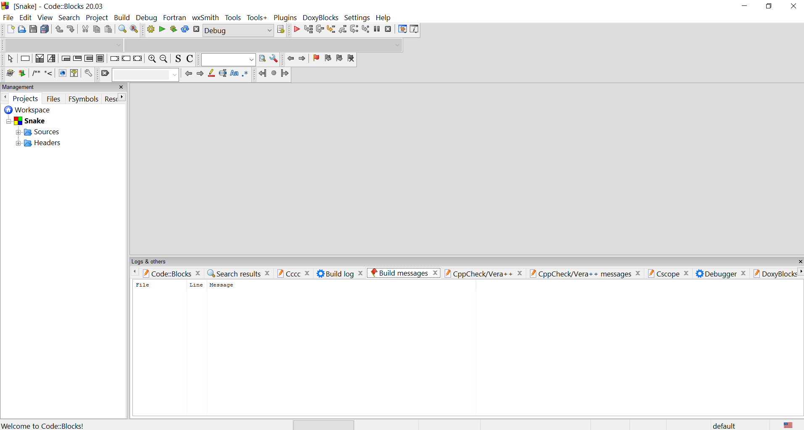

# Snake-game

## How to use

   After you have installed [CodeBlocks](https://www.codeblocks.org/downloads/) and cloned this repository, go in the main folder and double-click the `Snake.cbp` file. It should open the entire project in a new CodeBlocks window.
   
   Next, click on _Build and run_ (or _F9_) and it will open the game window. Enjoy!
   
   
